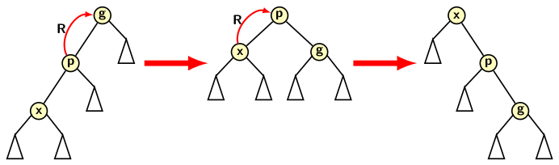
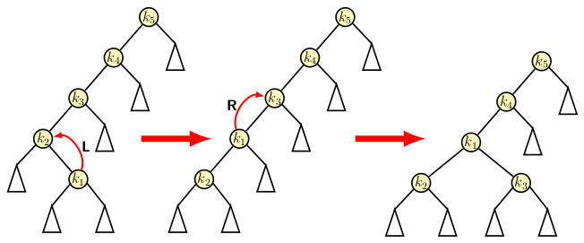
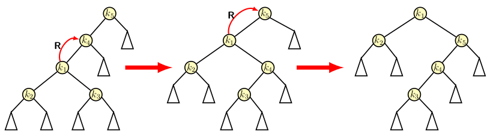
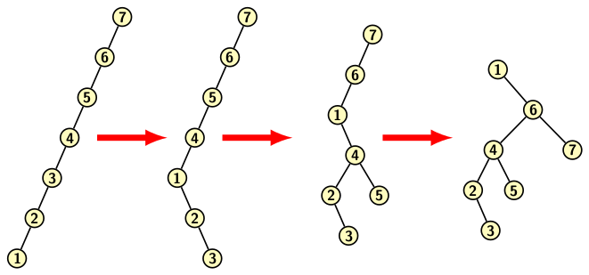

## Splay Trees

We learned about three different types of Binary Search Tree (BST) data 
structure, namely, AVL trees, Red-Black trees and B-trees. Splay trees
are another type of BST data structures. While most tree data 
structures attempt to improve the worstcase time per operation, splay 
trees follows a different approach. The splaying operation improves 
time for a set of <i>m</i> consecutive operations on a splay tree.
It takes at most O(<i>m log n</i>) time for <i>m</i> consecutive
operation, where <i>n</i> is the number of
nodes in the tree. It does not preclude the case that a single operation
may take up to O(<i>n</i>) time. So, the bound depends on the possibility
of not having operations which accesses the deepest leaf all the time. 
It works on the permise that good and bad operations equally likely. 
Some operation may be bad but others are good. Since <i>m</i> 
consecutive operations take time of O(<i>m log n</i>), the amortized cost
per operation is O(<i>log n</i>).

Splay tree works on the principle that the worst case time of O(<i>n</i>) for
an operation on a tree data structure is not that bad if it occurs 
infrequently. Such bad operation makes the tree bushy. Therefore, the
time for subsequent operations improve. For example, we may have a worst
case search in a binary search if the searched element is not present 
in the list. If every time the middle element is greater than the input 
element, then we continue to divide the tree. So, we have to perform 
partition repeatedly on the left half until we reach single element list 
and not find the element. The number of subdividision of the list 
is <i>log n</i> times. However if we are lucky then the element may 
be the middle element on the first division. So, it can be located in 
O(1) time. Both cases are possible when we search for an element in a list. 

A splay tree is a BST. In accessing an element <i>x</i>, we perform a 
sequence of splay operations that moves <i>x</i> to the root. 
The nature of a splay operation depends on following possibilities: 
1. <i>x</i> is the left/right child of its parent.
2. <i>p</i> is the root/non-root.
3. <i>p</i> is the left/right child of its parent.
We do not discuss the other three symmetric cases. 

The three non-symmertic splay operations are:
1. Zig: It requires a single right (R) rotation around <i>x</i>.  
2. Zig-zig: It requires a double right (RR) rotation around <i>x</i>.  
3. Zig-zag: It requires a left (L) then a right (R) rotation around <i>x</i>.  

The image below shows the three operations. First one is a single right
rotation.

  

A zig-zig splay is a RR type double rotation consisting of a right rotation
on <i>p</i> followed by a right rotation on <i>x</i>. 

  

A zig-zag splay is a LR type double roatation consisting of a left rotation
on <i>p</i> followed by a right rotation on <i>x</i>.

  

Having understood the basic splay operation let us examine how it helps using
a small example given in the image below:

  
  

The final tree, in bottom right most, becomes more bushy compared to 
the original tree which appears in the top leftmost image in the above figure.
Intuitive idea behind the splay operation is that instead of applying 
rotation every time, we delay the rotation until it becomes expensive.  
If operations continue to remain cheap then there is no reason to 
incur extra cost for applying rotation. Only when an operation is costly,
we reorganize the tree to make future operation cheaper. 

Let us see how splaying helps in an extended example. We start with an
extremely skewed initial tree consisting seven elements as in the figure
below. It moves element 1 to the root, and the tree becomes more bushy
than it was originally.

 
 

As the reader may observe the only operation used for turning the tree
into a bushy tree is rotation.

We end this blog here.

[Back to Index](../index.md)
