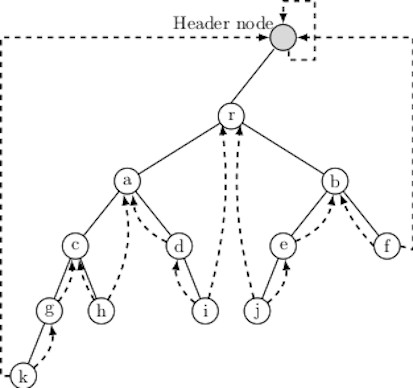
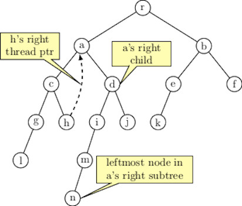

## Threaded Binary Tree

Threaded binary tree is an interesting data structure. Threads keep information about inorder successor and predecessor 
of every node in a binary tree. The node structure is augmented to store information about thread pointers. 
```
typedef enum{false, true} BOOL;
typedef struct thdnode {
    int info;
    thdnode * left, right;
    BOOL rtThd; 
    BOOL lftThd; 
} THD_TNODE;
```
In a normal (unthreaded) binary tree, if node does not have a left or right child its corresponding pointer is NULL. 
For a leaf node both pointers are NULL. In a threaded binary tree, all child pointers are valid except for two as shown in the figure below.
<p align="center">

</p>

The NULL child pointers are modified as follows:

- If a node does not have right child then its right child pints to the inorder successor.
- If a node does not have a left child, then its left child points to the inorder predecessor node. 

We need to distinguish between child and thread pointers. Each node is associated with two extra bits of information as the node structure indicates.
Threaded binary tree makes inorder traversal fast and simple. For example, the inorder successor of each node is found simply in following way:
```
THD_TNODE * inorderSuccesor(TH_TNODE * n) {
    THD_TNODE p = n->right;
    if (!(p->rtThd)) {
        while (!(p->ltThd)) 
           p = p->left; 
    }
    return p;
}
```
We have to consider two cases here:

- If a node's right pointer is a thread,
- If a node's right pointer is a valid child pointer.

In case 1, the inorder successor is accessed directly from the right pointer, because right pointer being a thread pointer. 
In case 2, the order successor should be the leftmost node in the tree reachable from the right subtree of the given node. 

<p align="center">

</p>
Let us consider the tree given above. We illustrate above two cases with two nodes <i>h</i> and <i>a</i> respectively. Since <i>h</i>'s right pointer 
is a thread, its inorder successor is <i>a</i> that is reachable from <i>h</i>'s right pointer. 
To find inorder successor of <i>a</i>, we should navigate to left most node in <i>a</i>'s right subtree. It is given by node <i>n</i>. 

Procedure for inorder predecessor is almost identical with right and left are interchanged. It appears below:
```
THD_TNODE * inorderPredecessor(TH_TNODE * n) {
    THD_TNODE p = n->left;
    if (!(p->ltThd)) {
        while (!(p->rtThd)) 
           p = p->right; 
    }
    return p;
}
```
