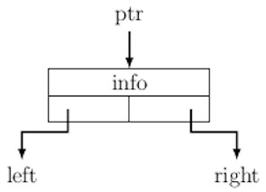

## Implementation of Binary Trees

Each node in a binary tree consists of at least three fields: (i) information, 
and (ii) a pointer to the left child, and (iii) a pointer to the right child
as shown in the figure below.   
<p align="center">

</p>
For illustration, we assume that the information stored at a 
node is just an integer. We can now define a C-structure for a tree node is
as follows:
```
typedef struct treeNode {
    int info;
    struct treeNode * left;
    struct treeNode * right;
} TREENODE;
```
<br />
It is essential to understand the implementation of the traversal 
procedures before looking at the implementation of other tree 
operations. Other operations on a binary tree are naturally implemented in 
a recursive manner using one or the other traversal procedure. 
<br />

Each traversal procedure uses recursive functions that traverse
the left and right subtrees. For example, in preorder traversal, the tree's root is visited first, following that the left and the right subtree of 
the root are traversed recursively. The C-function for preorder traversal 
is as follows:
```
void preOrder(TREENODE *t) {
    if (t != NULL) {
        printf("%d\t", t->info);
        preOrder(t->left);
        preOrder(t->right);
    }
}
```
In postorder traversal the root is visited only after completing traversal
of the left subtree, and the right subtree. It implies that only the ordering
of recursive functions are changed in postorder traversal.
```
void postOrder(TREENODE *t) {
    if (t != NULL) {
        postOrder(t->left);
        postOrder(t->right);
        printf("%d\t", t->info);
    }
}
```
<br />
In postorder traversal, the root is visited only after completing the traversal
of the left subtree and the right subtree. It implies that only the ordering
of recursive functions are changed in the postorder traversal.
```
void inOrder(TREENODE *t) {
    if (t != NULL) {
        inOrder(t->left);
        printf("%d\t", t->info);
        inOrder(t->right);
    }
}
```
<br />

Having understood the traversal implementation, we can now explain the 
creation of a binary tree. First, we implement the creation of a tree node 
using the following C function.
```
TREENODE * createNode() {
    TREENODE *p;
    int x;
    printf("Enter data:");
    scanf("%d",&x);
    if (x == -1)  // Use -1 for a NULL link
        return NULL; 
    else {
        p = (TREENODE *) malloc(sizeof(TREENODE));
        if (p != NULL) {
            p->info = x; // Data stored at the node
            p->left = NULL;
            p->right = NULL;
         }
         return p;
    }
}
```
Procedure <i>createNode()</i> basically allocates the storage for a tree 
node, and initializes its child links to NULL. It reads the information 
from user's input and stores the input in the node's information field. 
<br />
Next we create a binary tree by recursively defining its left and right 
subtree as in preorder traversal.
```
TREENODE * createBinaryTree() {
    TREENODE * p;
    p = createNode(); // Define a new node from user's input
    if (p != NULL) {
        p->left = createBinaryTree(); // Create the left subtree
        p->right = createBinaryTree(); // Create the right subtree 
    }
    return p;
}
```
<br />
After creation of left subtree is complete, the right subtree is created. Finally, the function returns the node. So, it is just like traversing
the tree starting from the root going down using left child pointers of every
newly node created node until a node has no left child. Then it creates 
the right child of the current node and proceeds as above. 

<br />
We will continue the rest of the implementation in the next blog. 

