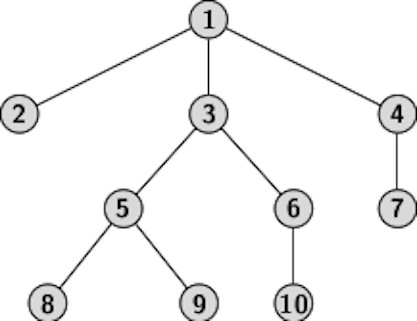
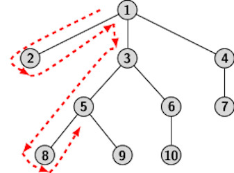

## Traversal of Trees

The processing of information stored in a tree data structure requires each node of the tree to be accessed at least once. A tree is accessible only by
its root node. However, as every node stores a pointer to its children, it is possible to access the children of a node when the latter is visited. 
Therefore, starting with the root, we can ccess all nodes of a tree by repeatedly following the children pointers from the node which has just been visited.
The three systematic ways of traversing a tree are: 
<ul>
  <li> Preorder traversal</li>
  <li> Postorder traversal</li>
  <li> Inorder traversal</li>
  </ul>
The output of a traversal procedure is a list of nodes ordered by their visit sequence.  It is convenient to visualize the each traversals as a recursive 
procedure: 
<ol>
  <li> For an empty tree, the empty sequence represents the preorder/postorder/inorder traversal list. </li>
  <li> If a tree consists of oonly the root node, then the root node represents the preorder/postorder/inorder traveral list.</li>
    <li> In general a tree T may be assumed to consist of a root <i>r</i>, and <i>k</i> subtrees T1, T2, ..., Tk. 
      <ul>
        <li> Preorder traversal of T is the list obtained by the root concatenated with preorder traversal lists of T1, T2, ...,
          Tk. </li>
        <li> Postorder traversal of T is the list obtained by the concatenation of postorder traversal lists of T1, T2, ...,
          Tk. </li> followed by the root.
      <li> Inorder traversal of T is the list obtained by the concatenation of inorder traversal list of T1 followed by the root then 
      the inorder lists of subtrees T2, ..., and Tk. </li>
    </ol>
    </ul>
Consider an example tree shown below to understand how the tree traversal procedures work.

  
  

The preorder traversal list of the above tree is obtained by concatenating four lists, namely, {1} with the preorder traversal lists of three subtrees 
T2,T3, and T4. Using the recursive extension of preorder traversal to the three subtrees of the root, we obtain:
<ul>
    <li> Preorder list of T2: {2},</li>
    <li> Preorder list of T3: {3,5,8,9,6,10},</li>
    <li> Preorder list of T4: {4,7},</li>
</ul>
Therefore, the concatenating four lists {1} {3,5,8,9,6} {4,7} gives preorder traversal list of T as: 1,3,5,8,9,6,10,4,7. In the same manner we 
can obtain the postorder and the inorder traversal lists as:
<ul>
  <li>Postorder: concatenate postorder lists of T1, T2, T3 and {1}: {2}, {8,9.5,10,6,3}, {7,4} </li>
  <li>Inorder: concatenate inorder lists of T1, {1}, T2, T3: {2}, {1}, {8,5,9,3,10,6}, {7,4} </li>
</ul>  
Traversal is essentially a walk around the tree as shown in the figure below:

  
  

The walk starts from the root. Stying close to branches, we walk down in the direction shown in the figure. During the walk, each node is visited one more 
time than the number children it has. For example, we encounter a leaf node only once during a walk. However, the root node in the tree above, is encountered
four times. Similarly, node 3 is visited four times:
<ul>
  <li>Once from the root when we walk down,</li>
  <li>Once when walking up from node 5</li>
  <li>Once when walking up from node 6</li>
</ul>
The reader can find that the sequence we get from the walk around the tree is given by:

   1(1)&nbsp2(1)&nbsp1(2)&nbsp3(1)&nbsp5(1)&nbsp8(1)&nbsp5(2)&nbsp9
  (1)&nbsp5(3)&nbsp3(2)&nbsp6(1)&nbsp10(1))&nbsp6(2)
  &nbsp3(3)&nbsp1(3)&nbsp4(1)7(1)&nbsp4(2)&nbsp1(4)

where subscript represent the instance of visiting a correspnding node. For example, node 1 is visited for the third instance when we walk up from node 3 and
come down to node 4. We can now link the walk around the tree with the three traversal lists as follows. 
<ul>
  <li>For preorder sequence: list out the node when it is visited for the first instance.</li>
  <li>For postorder sequence: list out the node when it is visited for the last instance.</li>  
  <li>For inorder sequence: list out the node when it is visited for the second instance.</li>  
</ul>
The list of node visits for last instance is:

2(1)&nbsp8(1)&nbsp9(1)&nbsp5(3)&nbsp10(1)&nbsp6(2)&nbsp3(3)&nbsp7
  (1)&nbsp4(2)&nbsp1(4)

Therefore, the postorder traversal sequence should be: 2 8 9 5 10 6 3 7 4 1 

For  binary trees <i>k=2</i>, we distinguish between two subtrees, the subtrees are referred to as the left subtree and the right subtree. 
The preorder, postorder and inorder traversals procedures are same as dicussed above but we can put them more compactly as follows:
<ul>
  <li> Preorder: visit the root, traverse left subtree in preorder, traverse the right subtree in preorder.</li>
  <li> Postorder: traverse left subtree in postorder, traverse the right subtree in postorder, visit the root.</li>
  <li> Inorder: traverse left subtree in inorder, visit the root, traverse the right subtree in inorder.</li>
  </ul>
For brevity, we denote the root as <i>r</i>, left subtree as <i>L</i> and right subtree as <i>R</i>. Using the notations, the preorder, postorder and inorder
traversals procedures can be represented symbolically as <i>rLR</i>, <i>LrR</i> and <i>LRr</i>. 

