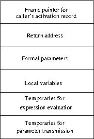

# Introduction to Stack 

This blog is about stacks. A stack is a linear list that allows insertions and 
deletions only at one end. If we insert a sequence of items, i1, i2, ..., ik
into a stack one after another then item ik will be on the stack. Now if we
remote items one after the other the sequence of removals will be in reverse
order. In the real world, stacks are used at many places. For example, stacks 
of books lying on tables in a library or stacks of plates placed on plate 
holders in restaurants. We cannot remove any item from the middle of a stack. 
It will lead to all items falling apart in a heap. However, if we remove items
one by one from top, the stack of remaining items maintains itself. 

 

Stack is an important data structure in programming. Every program execution
begins with all non-static variables on a stack called runtime stack. The 
stored objects on the runtime stack are collectively referred to as a stack 
frame or an activation record. A new stack frame for the called program gets 
pushed onto the runtime stack when a program calls another. The process ensures 
that the variables of the called program do not get accidentally modified. The 
stack-frame related to the calling program is not accessible until the current 
exit. On exit, the activation record is popped out, and the previous activation 
record becomes accessible.  So, the activation record is a private block of 
memory for the program in execution. It is also used to map the set of 
arguments or parameters to called programs memory. But before the control 
returns to the calling program,  one or more values are transferred from the 
called program. The transfer occurs in the form of a single return value and 
other side effects, such as copying values to local addresses of the calling 
program.  Therefore, in summary, an activation record looks like the one in the 
figure below.

 

Therefore a stack is a simple but important data structure.  

The next blog will focus on the implementation of stacks.

